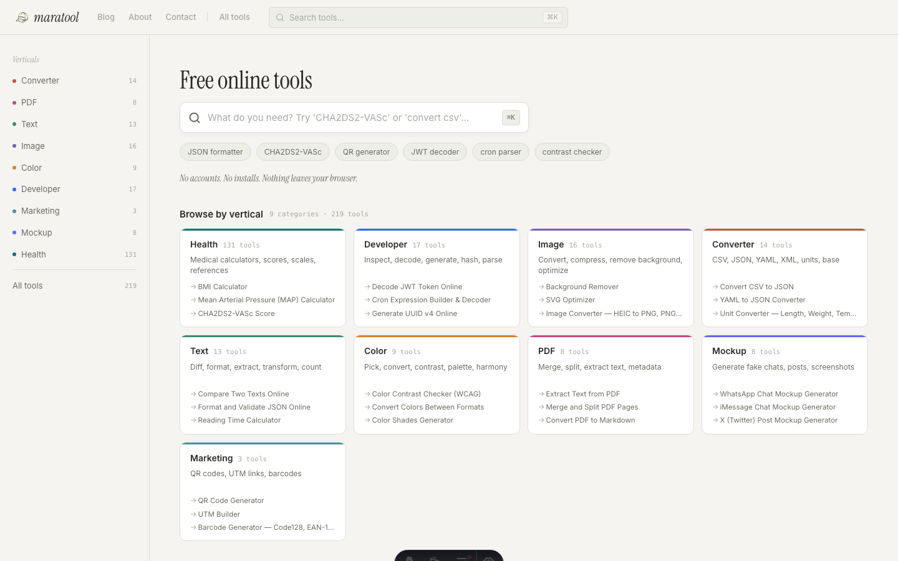
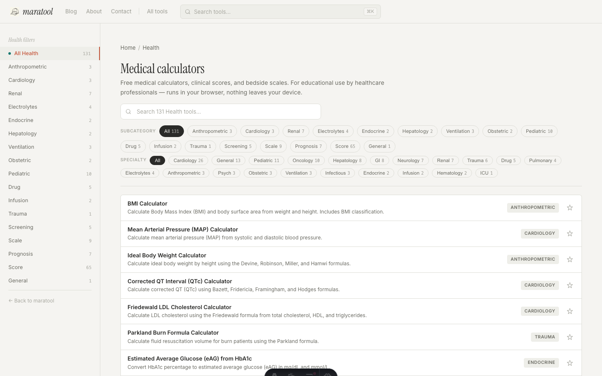
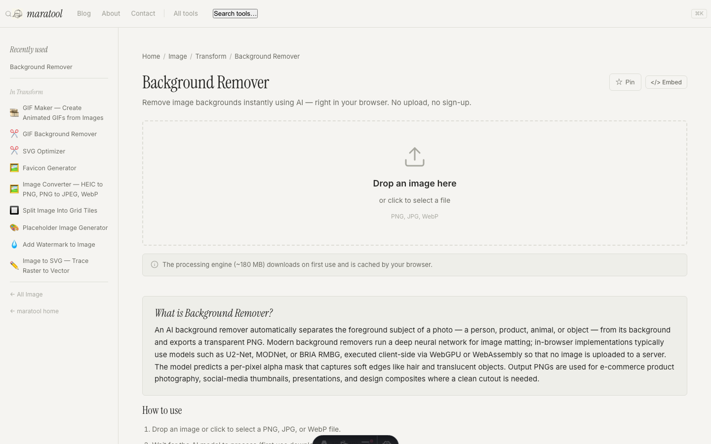

# maratool

A collection of free, browser-based developer, design, and productivity
tools. All tools run entirely client-side — no uploads, no accounts, no
tracking beyond standard AdSense (eventually, because currently there is no AdSense).

Live at **[maratool.com](https://maratool.com)**.

## Why this exists

There's a class of task I kept running into. Calculate a percentage I'm
too lazy to do in my head. Strip the background off an image or a GIF.
Throw together a phone mockup. Stuff you don't want to install an app
for, and definitely don't want to make an account for. For years I'd
google whichever site did the thing, ignore the ads, copy the result,
close the tab. Repeat next week with a different one.

AI can do some of these, but not always well, and sending private data
through an LLM just to extract text from a contract PDF is not what most
people want. So this is the alternative: a growing pile of small
browser-only tools where the math is right, your data stays on your
machine, and nothing is uploaded anywhere.

> **One honest exception.** The Instagram video downloader at
> `/instagram-video-downloader` is the only tool that talks to a server.
> Your browser sends the Instagram URL you paste to a small Cloudflare
> Worker in [`worker/`](./worker), which proxies the request to a
> third-party Instagram API. This is required because Instagram blocks
> direct fetches from the browser. The [privacy policy](https://maratool.com/privacy)
> documents exactly what that one tool does. Every other tool on the
> site is fully client-side.



It used to be just for me. Now the source is here, and contributions
are open. The full story is on the blog:
[Why I built maratool, and why it's open source now](https://maratool.com/blog/may-2026-open-source).





## Contributing

PRs welcome. Areas that need help in particular:

- **Health calculators.** Over a hundred clinical scores live under
  `src/pages/` and `src/tools/`, each implemented from the primary
  literature. Clinicians spotting a formula error, an outdated
  guideline, or a missing calculator: please open an issue or PR.
- **New tools.** If there's something you wish maratool had, see
  `src/data/tools.ts` for the registry, copy a small existing tool
  (e.g. `uuid-generator`) as a starting point, and open a PR.
- **Fixes.** Bug reports with a reproduction step go in GitHub Issues.

## License

This project is **source-available** under the
[O'Saasy License](./LICENSE). You can read, fork, modify, and self-host
the code freely. You **cannot** offer it to third parties as a competing
hosted, managed, or SaaS product.

> Note: O'Saasy is not an OSI-approved open-source license. It is a
> source-available license modelled on MIT with an added SaaS-competition
> clause. See [LICENSE](./LICENSE) for the full text.

## Stack

- **Framework:** [Astro](https://astro.build) (static output, zero JS framework)
- **Styling:** Plain CSS + CSS variables
- **Tool logic:** Vanilla JS in `src/tools/`
- **Hosting:** Cloudflare Pages (static)
- **Instagram media worker:** Cloudflare Worker in `worker/`

## Local development

```sh
npm install
npm run dev      # http://localhost:4321
```

Build a production bundle:

```sh
npm run build
npm run preview
```

Run unit tests:

```sh
npm test
```

## Deployment

Production runs on Cloudflare Pages. Every merge to `main` triggers an
automatic build and deploy — usually live on
[maratool.com](https://maratool.com) within 1–2 minutes.

## Self-hosting

The site is a pure static build — you can deploy `dist/` to any static
host (Cloudflare Pages, Netlify, Vercel, GitHub Pages, an S3 bucket).
Cloudflare Pages is what we use because it is free and global.

### Instagram media tool

The `/instagram` tool depends on a separate Cloudflare Worker in
`worker/`. To self-host that tool you need:

1. A Cloudflare account.
2. A [RapidAPI](https://rapidapi.com/) subscription to the
   `instagram120` API for the primary extraction path.
3. The worker deployed via `wrangler deploy` with `RAPIDAPI_KEY` set as
   a Cloudflare Worker secret:

   ```sh
   cd worker
   wrangler secret put RAPIDAPI_KEY
   wrangler deploy
   ```

   Without `RAPIDAPI_KEY`, the worker still works through the free
   `cobalt.tools` and `kohi` fallbacks, but quality and reliability
   drop.

4. Update `ALLOWED_ORIGIN` in `worker/wrangler.toml` to point at your
   own domain.

## Project structure

```
src/
├── components/   Astro components (Layout, Sidebar, Topbar, AdColumn, ToolShell, …)
├── data/         tools.ts — central registry of every tool's metadata
├── layouts/      Base.astro — HTML shell, meta, schema
├── pages/        Every tool, blog post, and content page (one .astro per route)
└── tools/        Vanilla JS implementations of each tool

worker/           Cloudflare Worker proxying Instagram media APIs
public/           Static assets served as-is (favicon, robots.txt, vendored libs)
scripts/          Build-time generators (llms.txt, palette JSON, OG images, lastmod)
```

## Reporting issues

- **Security vulnerabilities:** see [SECURITY.md](./SECURITY.md).
- **Bugs in a specific tool:** open a GitHub issue or email
  `maratool@marcell.com.br`.
- **Clinical/medical formula corrections:** email
  `maratool@marcell.com.br` — these are treated as priority.
